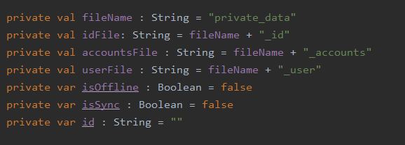
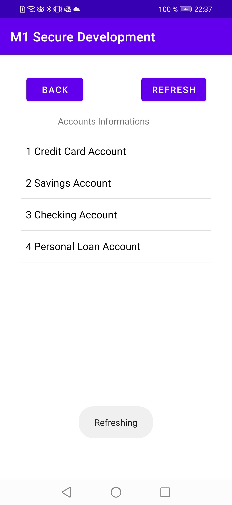

# M1_Secure_Development Project

> Main page of our app

## DO PHAM Alexandre IOS1

## Table of Contents
1. [Checking the user](#UserID) 
2. [User's data](#Userdata)
3. [Hiding the API URL](#HidingURL)
4. [Screenshots](#Screenshots)

## Explain how you ensure user is the right one starting the app ? 

> Screenshot of the write function which saves the data inside the app storage

We know that the right user is starting the app because during the first launch the ID written in the editText field is saved in the app storage.

Each time a user is starting the app we check the id written is the editText field with the saved value stored in the app storage (if the app is already synchronized).
So another user can't access to the app.

> The user used the wrong id.

During the first run of the app, (the app is not synchronized yet.) the device needs to be connected to internet,
if so, we check if the id inside the filed exists in the API data.
If it exists, we save the id inside the app internal storage, if not we throw an error.

> To reset the saved data, we implemented a reset button but it's only for test purposes not for the `released version`.

## How do you securely save user's data on your phone ?

We save the user's data in the app storage using `Read and Write Internal Storage`. 
The file stored in the internal storage is private in default, and only our app accesses it.

They cannot be accessed from outside the application.

When the user uninstall the app from the device, the internal storage file will also be removed.

> paths of the data inside the internal storage of the app.

## How did you hide the API url ?

First We use proguard to get a Bytecode Harder to read (also proguard will remove the debug log during the release). 

To strengthen it we also used a gradle plugin called Enigma.

With the help of Enigma all the string in our code will be encrypted. 
Unfortunately Enigma is only for java classes for now. 

So to solve this problem we create a java class which contains the API URL. 

Kotlin code is fully compatible with Java code so we can get the API URL from our koltin classes without any problems.

> Now we cannot reverse engineering to find the API URL because it's encrypted.

## Screenshots of your application

> Main page of the app.

---

> The user wrote a wrong id

---

> User page when connected to the internet (ONLINE MOD).

---

> User page when disconnected to the internet (OFFLINE MOD).

---

> Accounts page in which we can see all the accounts. (ONLINE MOD)

---

> Accounts page synchronized (OFFLINE MOD).
> The user can't refresh the accounts in OFFLINE MOD.

---

> Accounts page not synchronized (OFFLINE MOD). 
> To be sychronized the user must have already consulted this page at least once while being connected to the internet.

---

> Refreshing the page

---

> When we click on an account in the Accoutns page we can see its details inside a new page.
